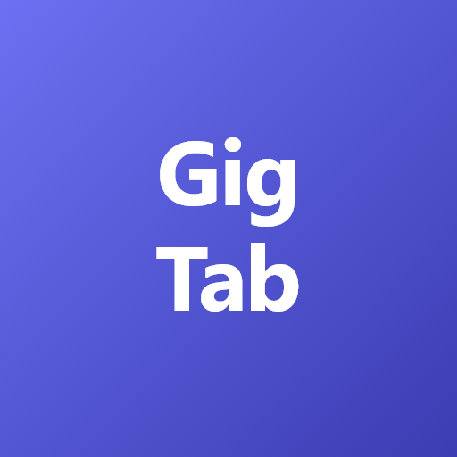

<div align="center" width="100%">
    
</div>

# GigTab

Live performance guitar tablature viewer for iPad and web. Forked from [louislam/its-mytabs](https://github.com/louislam/its-mytabs).

## Features

- Free and open source (MIT License)
- Upload `.txt` tab/chord files — rendered in monospace with auto-scroll
- Auto-scroll adapts when you swipe — remaining time adjusts to still reach the bottom on schedule
- Performance mode overlay for live gig use (hides UI chrome, tap to play/pause)
- Setlist management with song navigation
- Supports Guitar Pro formats: .gp, .gpx, .gp3, .gp4, .gp5, .musicxml, .capx
- Sync tabs with audio files (.mp3, .ogg) or YouTube videos
- MIDI Synth — mute/solo individual tracks
- PWA with offline support — install on iPad home screen
- iPad-optimized touch targets and responsive layout
- Dark/Light tab colors, multiple cursor modes
- Import from Ultimate Guitar (paste chord sheets)
- Keyboard shortcuts for desktop use

## Installation

Support: x64, ARM64

Tip: Youtube videos may not work on a private ip address (e.g. 192.168.x.x), use `localhost` or a public ip/domain instead.

### Windows (exe)

Download the latest release (gigtab-v1.x.x-windows.zip) from [Releases](https://github.com/strat4axe/gigtab/releases/latest) page, unzip it, and run `gigtab.exe`.

### Docker Compose

```yaml
services:
    app:
        image: strat4axe/gigtab:1
        ports:
            # Host Port:Container Port
            - "47777:47777"
        volumes:
            # Host Path:Container Path
            - ./data:/app/data
        restart: unless-stopped
```

```bash
docker compose up -d
```

Go to `http://localhost:47777` to access the web UI.

### Docker

```bash
docker run -d --name gigtab -p 47777:47777 -v gigtab:/app/data --restart unless-stopped strat4axe/gigtab:1
```

Go to `http://localhost:47777` to access the web UI.

### Deno (Non Docker) (Linux/Windows/MacOS)

Requirements:

- [Deno](https://deno.land/) 2.4.4 or above
- Git

```bash
git clone https://github.com/strat4axe/gigtab.git
cd gigtab

# Check out the latest version from Release page
git checkout 1.X.X --force
deno task setup
deno task start
```

Go to `http://localhost:47777` to access the web UI.

## Environment Variables

Create a `.env` file to configure:

```ini
# (string) Server Host (Default: not set, bind to all interfaces)
GIGTAB_HOST=

# (string) Server Port (Default: 47777)
GIGTAB_PORT=47777

# (boolean) Whether to launch the browser when starting the app (Desktop only) (Default: true)
GIGTAB_LAUNCH_BROWSER=true
```

## Keyboard Shortcuts

| Key         | Description                                            |
| ----------- | ------------------------------------------------------ |
| Space       | Toggle Play / Pause                                    |
| Arrow Left  | Move cursor to the previous bar                        |
| Arrow Right | Move cursor to the next bar                            |
| Arrow Up    | Restart - Play from the start of the highlighted range |
| S           | Play from the first bar containing notes (-2 offset)   |

## Development

```bash
deno install
cd frontend && deno install
cd ..
deno task dev
```

## Special Thanks

- [AlphaTab](https://github.com/CoderLine/alphaTab) by [Daniel Kuschny](https://github.com/Danielku15) — tab rendering engine
- [louislam/its-mytabs](https://github.com/louislam/its-mytabs) — the upstream project this was forked from
